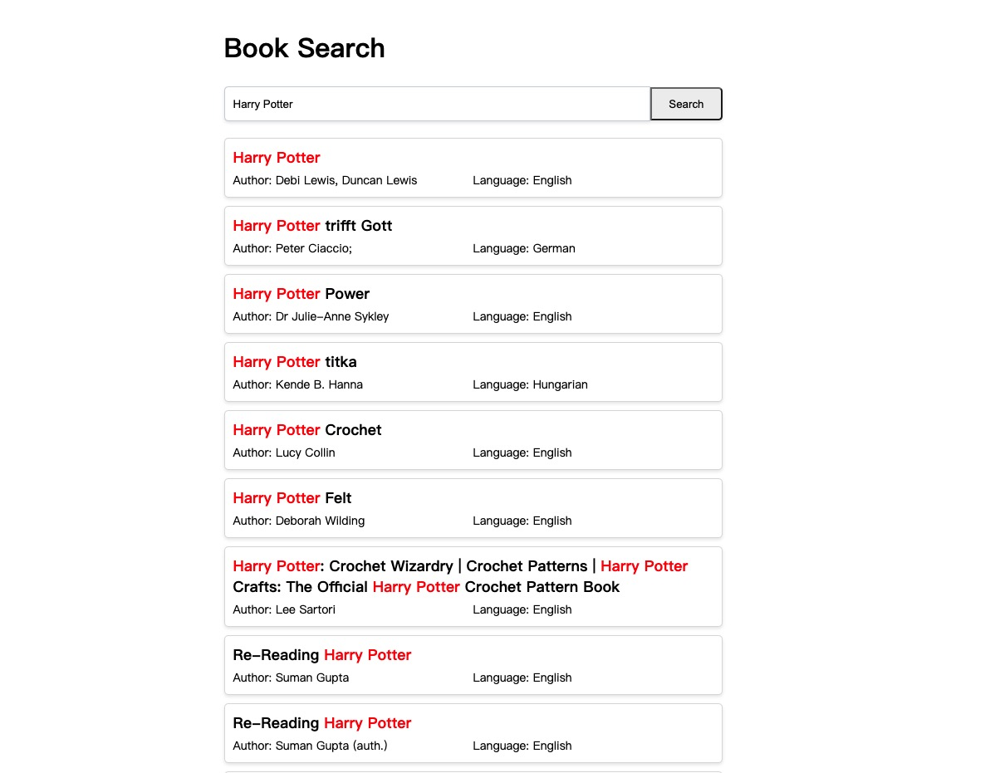

# Building An Open Source Decentralized E-Book Search Engine

Recently, I was recommended an ebook search website called [Liber3](https://liber3.eth.limo/) by a friend, which uses [ENS](https://ens.domains/) domain names. They have created an e-book search website running on ENS and [IPFS](https://ipfs.tech/). Then, I conducted some analysis on their network requests and found that they appear to be using [Glitter](https://glitterprotocol.io/), a decentralized database service built with [Tendermint](https://tendermint.com/).

Unfortunately, because [Liber3](https://liber3.eth.limo/) has not made their source code available, after reviewing Glitter's documentation and open datasets stored on it, I decided to implement an open-source community version myself. This way, everyone can create their own e-book search website.

### Step 1 - Initialize the Project

First, create a new project and install Glitter SDK. This SDK allows you to easily connect to the Glitter network and obtain metadata of e-books.
<!-- tabs:start -->

#### **JavaScript**
``` shell
npm install @glitterprotocol/glitter-sdk
```

### **Python**

``` shell 
pip install glitter-sdk
```
<!-- tabs:end -->

### Step 2 - Connect to the Network

Next, generating a client so that the application can interact with Glitter network. We initialize an LCDClient instance through Glitter SDK and configure the relevant parameters

<!-- tabs:start -->

#### **JavaScript**

``` js
import { LCDClient, MnemonicKey, Coins, Numeric } from '@glitterprotocol/glitter-sdk';

const XIAN_HOST = "https://api.xian.glitter.link"
const CHAIN_ID = "glitter_12000-2"
const mk = new MnemonicKey({
    mnemonic: "lesson police usual earth embrace someone opera season urban produce jealous canyon shrug usage subject cigar imitate hollow route inhale vocal special sun fuel"
});

const client = new LCDClient({
    URL: XIAN_HOST,
    chainID: CHAIN_ID,
    gasPrices: Coins.fromString('0.15agli'),
    gasAdjustment: Numeric.parse(1.5),
})
const dbClient = client.db(key);
```

### **Python**

```python
from glitter_sdk.client.lcd import LCDClient
from glitter_sdk.core import Numeric, Coins
from glitter_sdk.key.mnemonic import MnemonicKey

XIAN_HOST = "https://api.xian.glitter.link"
CHAIN_ID = "glitter_12000-2"
mk = MnemonicKey(
    "lesson police usual earth embrace someone opera season urban produce jealous canyon shrug usage subject cigar imitate hollow route inhale vocal special sun fuel"
)

client = LCDClient(
    chain_id=CHAIN_ID,
    url=XIAN_HOST,
    gas_prices=Coins.from_str("0.15agli"),
    gas_adjustment=Numeric.parse(1.5))
dbClient = client.db(mk)
```

<!-- tabs:end -->

### Step 3 - Build Search Function

The search function is the core of the application. We define a search function that accepts the user's query keywords, constructs a query statement, and sends it to the Glitter network.

<!-- tabs:start -->

#### **JavaScript**


``` js
import { MatchPhraseQuery, queryStringPrepare, prepareSQL } from '@glitterprotocol/glitter-sdk';

const queries = [];
const query = 'Come Prima'
queries.push(new MatchPhraseQuery('title', `${query}`));
const queryStr = queryStringPrepare(queries);

const sql = `SELECT ipfs_cid, title, author, extension, language, publisher, year, filesize, _score, _id FROM library.ebook WHERE query_string(?) LIMIT 0, 200`;
const newSql = prepareSQL(sql, queryStr);
const sqlData = await dbClient.query(newSql);
```

### **Python**

```python
from glitter_sdk.util.parse_query_str import *
from glitter_sdk.util.parse_query_str import *
from glitter_sdk.util. parse_sql  import *

queries = []
query = "Come Prima"
queries.append(MatchPhraseQuery("title", query))
query_str = query_string_prepare(queries)
sql = "SELECT ipfs_cid, title, author, extension, language, publisher, year, filesize, _score, _id FROM library.ebook WHERE  query_string(%s)"
sql = prepare_sql(sql, [query_str])
rst = db.query(sql)
```

<!-- tabs:end -->

### Step 4 - Display Search Results

After building search function, we need to display search results on front-end interface. This includes designing a interface to show the basic information of e-books and providing some interactive elements so that users can easily browse and select the books they are interested in.



With these four steps, we can build a e-book search engine, providing users with an efficient and convenient platform for retrieving e-book resources. You could publish a compiled version of this website to IPFS network, then you are having a decentralized ebook search engine hosted on IPFS accessible via any [IPFS gateway](https://docs.ipfs.tech/concepts/ipfs-gateway/).

The entire source code is available [here](https://github.com/j2qk3b/ebook-demo) in this repo.